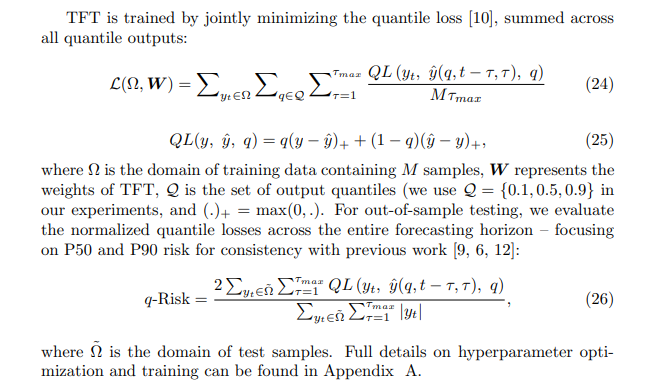

Temporal Fusion Transformers for Interpretable Multi-horizon Time Series Forecasting

> - TFT（https://arxiv.org/pdf/1912.09363.pdf）
> - DIN
> - 

Practical multi-horizon forecasting applications commonly have access to a variety of data sources, as shown in Fig. 1, including known information about the future (e.g. upcoming holiday dates), other exogenous time series (e.g. historical customer foot traffic), and static metadata (e.g. location of the store) – without any prior knowledge on how they interact. This heterogeneity of data sources together with little information about their interactions makes multi-horizon time series forecasting particularly challenging.

多水平预测问题( multi-horizon forecasting)通常包含复杂的输入组合：1.包括静态协变量（商店地址，用户性别等静态属性）、已知的未来输入（如未来法定的节假日）、历史观测时间变量（历史客户流量）。这种多层次的数据怎么设计t它们之间的交互是一个问题。

深度模型用来做多层次的数据交互有一个问题，就是它是个黑盒子，你不知道出来的结果的逻辑，而对于一些需要有解释性的场景来说这是致命的。那有没有一个模型既可以融合多层次的信息，又可以给与结果一定的解释性呢？Temporal Fusion Transformer（TFT）就是这样提出的。

### TFT 

TFT有四个特点，解决两个问题： 

 (1) static covariate encoders which encode context vectors for use in other parts of the network, (2) gating mechanisms throughout and sample-dependent variable selection to minimize the contributions of irrelevant inputs, (3) a sequence-to-sequence layer to locally process known and observed inputs, and (4) a temporal self-attention decoder to learn any long-term dependencies present within the dataset. The use of these specialized components also facilitates interpretability; 

> **(1)控制机制，**跳过架构中任何未使用的组件，提供自适应深度和网络复杂性，以适应大范围的数据集和场景。门控线性单元在整个体系结构中得到了广泛的应用，门控剩余网络被提出作为主要的构建模块。
> **(2)变量选择网络，**在每个时间步选择相关的输入变量。
> **(3)静态协变量编码器，**通过对上下文向量进行编码，以条件时间动态，将静态特征融入到网络中。
> **(4)时间处理，**学习长期和短期的时间关系，同时自然地处理观察到的和先验知道的时变输入。一个序列-序列层被用于局部特征处理，而长期依赖关系被捕获使用一个新的可解释的多头注意块。
> **(5)多水平预测区间预测，**在每个预测水平产生分位数预测

**论文中展示了TFT的三个可解释性的场景：1.分析重要变量对于一个给定的预测问题。2.可视化持续时间关系(如季节性) 3.重要的事件。**

**模型输入：**

|                | observed_input | known_input | target | static |
| -------------- | -------------- | ----------- | ------ | ------ |
| real_value     |                |             |        |        |
| category_count |                |             |        |        |

列为输入类型，行为数据类型

**模型网络**

> 1. 规定输入格式： all_inputs = (batch,time_steps,combined_input_size) = (batch,192,5,1) 
> 2. 其次，调用get_tft_embedding函数生成各种输入, 处理成同一纬度。
> 3. 将未知输入，已知输入，输出连接为known_combined_layer：(batch,192,5,1) -> (batch,192,5,3)。
> 4. 取known_combined_layer与obs_inputs每个滑动窗口的前encoder_steps个数据historical_inputs 作为编码器的输入，取known_combined_layer每个滑动窗口的剩余数据future_inputs 作为解码器的输入。

输入规范性处理函数get_tft_embedding，目的在于规范化各项输入，嵌入相同的维度。all_inputs格式为(batch, time_step, 5)。time_step=192,演示以下数据流。

> 1. 检查预处理数据，可观测数据中不含输出，可观测数据不是静态量，以及输入格式相符。
> 2. 创建embeddings层，每个category列都是一个embedding, (batch,192,1)->(batch, 192, 5)。
> 3. 生成静态**static**输入，取每个滑动窗口每个static列的第一个数据(batch,1)，t通过Dense层转化为(batch,5),与上述category列[:, 0, :]相加，得到静态输入[batch,5]。reshape为[batch,1,5]
> 4. 处理**target**输出格式，取每个滑动窗口每个target列(batch, 192, 1)，通过Dense层生成 (batch, 192, 5) ，reshape为(batch, 192, 5,1) 。
> 5. 生成**observed_input**可观测输入,取每个滑动窗口中的category列中的observed列(batch,192,1)，embedding为(batch,192,5);取每个滑动窗口中的real_value列中的observed列(batch,192,1)，embedding为(batch,192,5),将两者连接reshape(batch,192,5,1)。
> 6. 生成**known_input**已知输入，分别取每个滑动窗口中real_value与category列的known_input列(None,192,1)embedding为(None,192,5);数组连接将两者reshape(None,192,5,1)。
> 7. 最后，返回**可观测输入，已知输入，输出，静态输入**。

**分位数损失函数**

解释下分位数损失max(q * (y-y_pred), (1-q) * (y_pred-y))：

在常规的mse中，每个样本的loss 是 (y-y_pred)**2 ，而这里则使用了上述的公式来处理。

可以看到y-y_pred和 y_pred-y几乎必然是一正一负，（y-y-pred）=0的情况在nn中几乎不可能实现，所以其实本质上是一个选择函数，选择其中大于0的。

> 这里分两种情况：
>
> 1、y-y_pred>0，即模型预测偏小，则max(0.9* (y-y_pred), 0.1 * (y_pred-y))=0.9* (y-y_pred)，loss的增加更多。
>
> 2、y-y_pred<0，即模型预测偏大，则max(0.9* (y-y_pred), 0.1 * (y_pred-y))=0.1* (y_pred-y)，loss的增加更少。
>
> 很明显，第一个式子的loss占比要比第二个式子大多了，权重是9倍的关系，所以训练的过程中，**模型会越来越趋向于预测出大的数字**，这样loss下降的更快，则模型的整个拟合的超平面会向上移动，达到了上图的效果。

### Reference

https://www.zhihu.com/search?type=content&q=Temporal%20Fusion%20Transformers

https://zhuanlan.zhihu.com/p/461795429

code https://github.com/jdb78/pytorch-forecasting
